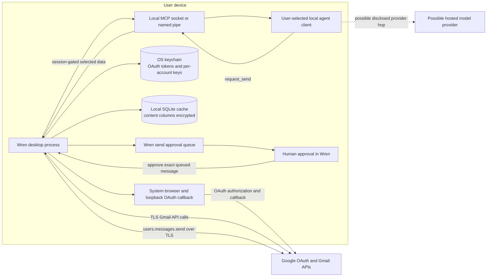

# Google OAuth data flow

## Architecture

Wren is an installed desktop client. The app uses a system browser and a loopback callback for OAuth 2.0 with PKCE. It requests only `gmail.modify`. The OAuth authorization, token, and Gmail endpoints are Google endpoints. OAuth tokens stay in the operating-system keychain. Sources: `src/core/auth/oauth.ts:1-17`, `src/core/auth/oauth.ts:126-151`, and `src/core/auth/oauth.ts:410-457`.

Wren fetches Gmail data directly from Google over TLS. It stores the local mail cache in SQLite. Content columns use AES-256-GCM with one key per account. The operating-system keychain stores those keys. Sources: `src/core/gmail/api.ts:40-42`, `src/core/gmail/api.ts:188-228`, `src/core/store/db.ts:41-185`, `src/core/store/db.ts:253-269`, and `SECURITY.md:29-40`.

The optional MCP gateway uses a user-restricted local socket or named pipe. It is not a TCP listener. A user-created agent client can receive selected mail data only during an active, time-bounded session. Some agent clients send their tool results to a hosted model provider. Wren discloses that possible provider path before session consent. Sources: `SECURITY.md:17-20`, `src/core/agents/sessions.ts:1-15`, `src/core/gateway-server/tools.ts:116-127`, and `src/features/agents/agents-settings.tsx:264-368`.

An agent cannot dispatch mail. An agent send request enters Wren's approval queue. A person must approve the exact queued message in Wren before Wren calls Gmail. Sources: `src/core/agents/gateway.ts:236-254`, `src/core/agents/approvals.ts:50-83`, and `src/core/agents/approvals.ts:110-149`.

## Complete flow

## Network boundary

Wren has no telemetry server and no Wren-operated mail server. Wren opens no other network path for Gmail data. Its direct remote peers are Google's OAuth and Gmail endpoints. The OAuth callback and agent gateway are local endpoints. A hosted-model transfer is a separate hop made by the user-selected agent client after Wren's session consent. Source: `SECURITY.md:10-20`.

> NOTE: `site/index.html:46` and `site/privacy.html:46` say that Google is the only network peer for mail. Those absolute sentences can hide the disclosed agent-provider hop. The same pages disclose that hop at `site/index.html:39-40` and `site/privacy.html:48-50`. Review the absolute sentences before submission. This document follows the complete current path.
