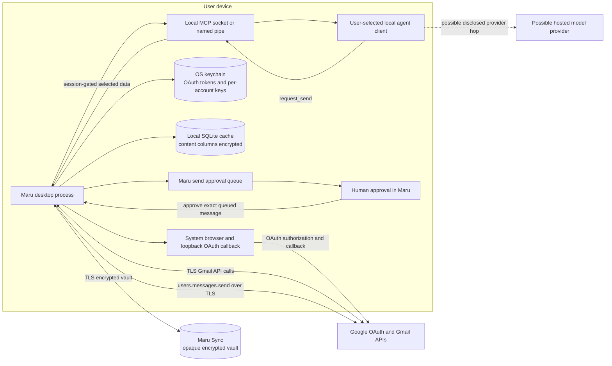

# Google OAuth data flow

## Architecture

Maru is an installed desktop client. The app uses a system browser and a loopback callback for OAuth 2.0 with PKCE. It requests only `gmail.modify`. The OAuth authorization, token, and Gmail endpoints are Google endpoints. OAuth tokens stay in the operating-system keychain. With optional Maru Sync, refresh tokens also enter an end-to-end encrypted vault. Access tokens never enter that vault. Sources: `src/core/auth/oauth.ts` and `src/core/account/`.

The Maru sync service stores opaque vault ciphertext and a version number. The account key stays in each signed-in device's operating-system keychain. The service has no key that can decrypt settings, addresses, or refresh tokens. Mail content, headers, identifiers, agent grants, and the audit log never enter the vault. Sources: `docs/spec/MARU-ACCOUNT.md` and `src/core/account/vault.ts`.

Maru fetches Gmail data directly from Google over TLS. It stores the local mail cache in SQLite. Content columns use AES-256-GCM with one key per account. The operating-system keychain stores those keys. Sources: `src/core/gmail/api.ts:40-42`, `src/core/gmail/api.ts:188-228`, `src/core/store/db.ts:41-185`, `src/core/store/db.ts:253-269`, and `SECURITY.md:29-40`.

The optional MCP gateway uses a user-restricted local socket or named pipe. It is not a TCP listener. A user-created agent client can receive selected mail data only during an active, time-bounded session. Some agent clients send their tool results to a hosted model provider. Maru discloses that possible provider path before session consent. Sources: `SECURITY.md:17-20`, `src/core/agents/sessions.ts:1-15`, `src/core/gateway-server/tools.ts:116-127`, and `src/features/agents/agents-settings.tsx:264-368`.

An agent cannot dispatch mail. An agent send request enters Maru's approval queue. A person must approve the exact queued message in Maru before Maru calls Gmail. Sources: `src/core/agents/gateway.ts:236-254`, `src/core/agents/approvals.ts:50-83`, and `src/core/agents/approvals.ts:110-149`.

## Complete flow

## Network boundary

Maru has no telemetry server and no Maru-operated mail server. Its direct remote peers are Google's OAuth and Gmail endpoints plus the optional sync service, which receives only encrypted vault blobs. The OAuth callback and agent gateway are local endpoints. A hosted-model transfer is a separate hop made by the user-selected agent client after Maru's session consent.

The public homepage, privacy policy, and security page disclose the encrypted sync path separately from mail traffic.
